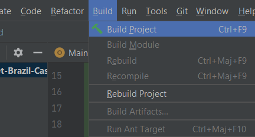
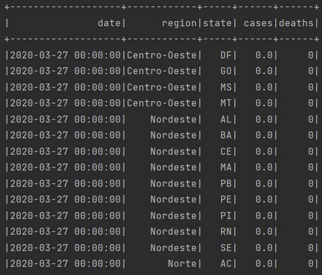

# Brazil-cases

Repository contains data processing of a csv file containing number of covid's cases and deaths in brazil

### + Instructions :

To clone the repo :

`git clone https://github.com/AymanIlyass/brazil-cases.git`

The two ways to execute the notebook locally with parameters are: (1) through the Python API and (2) through the command line interface.

The **notebook/notebook.ipynb** file contains the code written in python.

And the other files presented in the git structure contains the Scala project built in locally, and adapted to Spark environment via **yarn**.

- Execute via the Python API :

The execute_notebook function can be called to execute an input notebook when passed a dictionary of parameters:

`execute_notebook(<input notebook>, <output notebook>, <dictionary of parameters>)`

    import papermill as pm

    pm.execute_notebook(
    'path/to/input.ipynb',
    'path/to/output.ipynb',
    parameters=dict(alpha=0.6, ratio=0.1))

- Execute via CLI :

To execute a notebook using the CLI, enter the papermill command in the terminal with the input notebook, location for output notebook, and options.

Here’s an example of a local notebook being executed and output to an Amazon S3 account:

` papermill local/input.ipynb s3://bkt/output.ipynb -p alpha 0.6 -p l1_ratio 0.1 `

+ Build .jar file

We then, can compile the Scala project within the .JAR file by building the artifacts then building the project with IntelliJ (or any IDE that runs on JVM machine) :

+ Run the batch using the spark-submit command locally

`
spark-submit --class mr.MainRun --master yarn-client --conf spark.driver.extraJavaOptions=-Dconfig.file=./conf/application.conf --jars ./conf/config-1.2.1.jar --num-executors=4 --executor-memory 4G --driver-memory 4g --conf spark.yarn.executor.memoryOverhead=2048 --deploy-mode client jar-file.jar "rec"
`

+ Run the batch using the spark-submit command via AWS

`
spark-submit --class mr.MainRun --master yarn-client --conf spark.driver.extraJavaOptions=-Dconfig.file=./conf/application.conf --jars ./conf/config-1.2.1.jar --num-executors=4 --executor-memory 4G --driver-memory 4g --conf spark.yarn.executor.memoryOverhead=2048 --deploy-mode client jar-file.jar "rec"
`

+ Copy the data to AWS s3

1. Create an IAM role with S3 write access or admin access
2. Map the IAM role to an EC2 instance
3. Install AWS CLI in EC2 instance
4. Run the AWS s3 cp command to copy the files to the S3 bucket

- Fetch **new_brazil_covid19.csv** and  **report_diff.json** file from aws

1. In the Amazon S3 console, choose your S3 bucket, choose the needed file or download, choose Actions, and then choose Open or Download.
2. If you are downloading an object, specify where you want to save it.

*The procedure for saving the object depends on the browser and operating system that you are using.*

A mill configuration is delivered in the same path as th README file **mill-conf.py**

The output csv is in **output/new_brazil_covid19.csv**

The notebook contains the steps to make the source table's structure fits the output file's structure

CSV File : [Click Here](https://github.com/AymanIlyass/brazil-cases/blob/main/output/new_brazil_covid19.csv)

JSON File : [Click Here](https://github.com/AymanIlyass/brazil-cases/blob/main/report-diff.json)